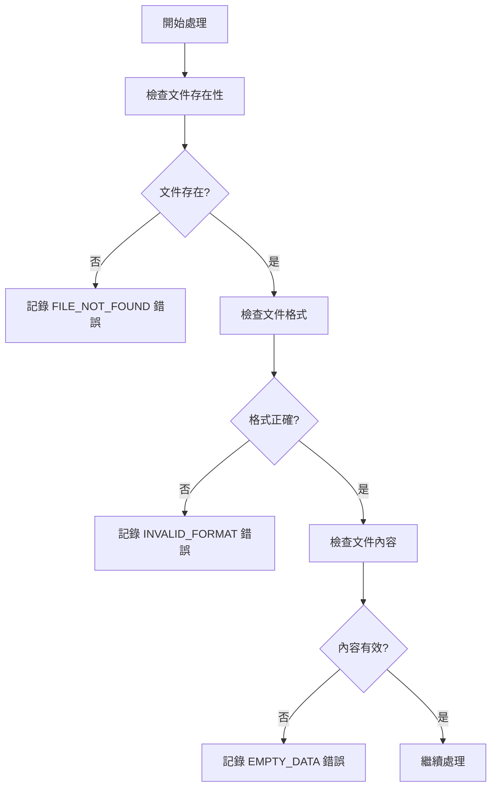

# 錯誤處理與日誌記錄功能指南

## 概述

`run_pipeline.sh` 現在包含了全面的錯誤處理和日誌記錄功能，能夠自動檢測、記錄和分析處理過程中遇到的各種問題。

## 新增功能

### 🔍 **自動錯誤檢測**

系統會自動檢測以下類型的錯誤：

1. **文件讀取錯誤**
   - 文件不存在
   - 文件權限問題
   - 編碼錯誤
   - 文件損壞

2. **數據格式錯誤**
   - CSV 格式不正確
   - 缺少必需列
   - 數據類型錯誤
   - 空數據

3. **處理錯誤**
   - ASR 處理失敗
   - 評估計算錯誤
   - 預處理失敗

4. **系統錯誤**
   - 目錄不存在
   - 磁盤空間不足
   - 內存不足

### 📝 **詳細日誌記錄**

#### 錯誤日誌文件 (`error_analysis.log`)

包含以下信息：
- **時間戳**：錯誤發生的精確時間
- **錯誤類型**：分類的錯誤類型
- **錯誤描述**：詳細的錯誤信息
- **文件路徑**：相關文件的位置
- **上下文信息**：錯誤發生的環境信息

#### 錯誤類型分類

| 錯誤類型 | 描述 | 嚴重程度 |
|----------|------|----------|
| `FILE_NOT_FOUND` | 文件或目錄不存在 | 高 |
| `INVALID_FORMAT` | 文件格式不正確 | 高 |
| `ENCODING_ERROR` | 文件編碼問題 | 中 |
| `EMPTY_DATA` | 數據為空或無效 | 中 |
| `LOAD_ERROR` | 數據加載失敗 | 高 |
| `ANALYSIS_ERROR` | 分析過程錯誤 | 中 |
| `MISSING_GROUND_TRUTH` | 缺少對應的 ground truth | 中 |
| `SUSPICIOUS_CONTENT` | 內容可疑或異常 | 低 |

### 📊 **增強的模型文件分析**

新的 `analyze_model_files_enhanced.py` 提供：

1. **文件狀態分析**
   - 成功處理的文件
   - 空文件
   - 錯誤文件
   - 缺少 ground truth 的文件

2. **內容質量檢查**
   - 文件大小檢查
   - 編碼檢測
   - 可疑內容模式檢測
   - 內容長度驗證

3. **詳細報告**
   - 每個模型的處理統計
   - 問題文件的詳細列表
   - 錯誤和警告的匯總

## 使用方法

### 1. **基本使用**

錯誤處理功能會自動啟用，無需額外參數：

```bash
./run_pipeline.sh \
    --input_dir /path/to/audio \
    --output_dir /path/to/results
```

### 2. **查看錯誤報告**

處理完成後，檢查以下文件：

```bash
# 查看錯誤日誌
cat /path/to/results/error_analysis.log

# 查看模型文件分析
cat /path/to/results/model_file_analysis.txt

# 查看管道摘要
cat /path/to/results/pipeline_summary.txt
```

### 3. **錯誤日誌格式**

```
[ERROR] 2025-07-27T07:02:40.158884 - FILE_NOT_FOUND: Ground truth file not found
  Details: The ground truth file is required for analysis
  File: /path/to/ground_truth.csv

[WARNING] 2025-07-27T07:02:40.158831 - ANALYSIS_START: Starting enhanced model file analysis
  Details: Transcript dir: /path/to/transcripts, Ground truth: /path/to/ground_truth.csv
```

## 錯誤處理流程

### 1. **錯誤檢測階段**



### 2. **錯誤記錄階段**

- 實時記錄錯誤到日誌文件
- 分類錯誤類型
- 保存上下文信息
- 提供修復建議

### 3. **錯誤報告階段**

- 生成錯誤統計
- 創建詳細分析報告
- 整合到管道摘要中

## 常見錯誤及解決方案

### 1. **文件不存在錯誤**

**錯誤信息**：
```
[ERROR] FILE_NOT_FOUND: Ground truth file not found
```

**解決方案**：
- 檢查文件路徑是否正確
- 確認文件確實存在
- 檢查文件權限

### 2. **格式錯誤**

**錯誤信息**：
```
[ERROR] INVALID_FORMAT: Missing required columns
```

**解決方案**：
- 確認 CSV 文件包含必需的列（Filename, transcript）
- 檢查 CSV 格式是否正確
- 驗證數據類型

### 3. **編碼錯誤**

**錯誤信息**：
```
[ERROR] ENCODING_ERROR: Failed to decode file
```

**解決方案**：
- 檢查文件編碼（建議使用 UTF-8）
- 重新保存文件為正確編碼
- 使用文本編輯器檢查文件內容

### 4. **空數據錯誤**

**錯誤信息**：
```
[WARNING] EMPTY_DATA: File contains only whitespace
```

**解決方案**：
- 檢查文件是否為空
- 確認數據是否正確寫入
- 檢查處理流程是否正確

## 監控和維護

### 1. **定期檢查**

```bash
# 檢查錯誤數量
grep -c "\[ERROR\]" /path/to/results/error_analysis.log

# 檢查警告數量
grep -c "\[WARNING\]" /path/to/results/error_analysis.log

# 查看最新錯誤
tail -20 /path/to/results/error_analysis.log
```

### 2. **錯誤趨勢分析**

```bash
# 按錯誤類型統計
grep "\[ERROR\]" /path/to/results/error_analysis.log | \
    awk '{print $4}' | sort | uniq -c | sort -nr
```

### 3. **性能監控**

- 監控處理時間
- 檢查磁盤使用情況
- 監控內存使用

## 最佳實踐

### 1. **預防性檢查**

```bash
# 在運行管道前檢查環境
ls -la /path/to/audio/
ls -la /path/to/ground_truth.csv
df -h /path/to/output/
```

### 2. **錯誤處理策略**

- 設置適當的錯誤閾值
- 實施自動重試機制
- 建立錯誤通知系統

### 3. **日誌管理**

- 定期清理舊日誌
- 實施日誌輪轉
- 備份重要日誌

## 故障排除

### 1. **日誌文件不生成**

**可能原因**：
- 權限問題
- 磁盤空間不足
- 目錄不存在

**解決方案**：
```bash
# 檢查權限
ls -la /path/to/output/

# 檢查磁盤空間
df -h

# 創建目錄
mkdir -p /path/to/output/
```

### 2. **錯誤信息不完整**

**可能原因**：
- 腳本提前退出
- 權限不足
- 編碼問題

**解決方案**：
```bash
# 檢查腳本權限
chmod +x run_pipeline.sh

# 檢查 Python 腳本
chmod +x analyze_model_files_enhanced.py

# 設置正確的編碼
export PYTHONIOENCODING=utf-8
```

### 3. **性能問題**

**可能原因**：
- 大文件處理
- 內存不足
- 磁盤 I/O 瓶頸

**解決方案**：
- 分批處理大文件
- 增加系統內存
- 使用 SSD 存儲

## 總結

新的錯誤處理功能提供了：

✅ **全面的錯誤檢測**：自動識別各種類型的錯誤  
✅ **詳細的日誌記錄**：提供完整的錯誤上下文  
✅ **智能錯誤分類**：按嚴重程度和類型分類  
✅ **實用的解決方案**：提供具體的修復建議  
✅ **易於監控**：便於追蹤和維護  

這些功能大大提高了管道的可靠性和可維護性，幫助用戶快速識別和解決問題。 